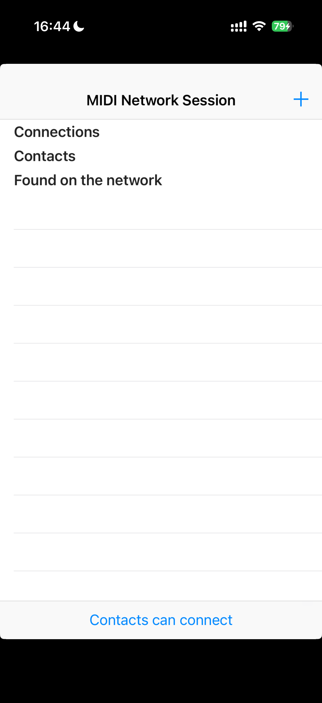
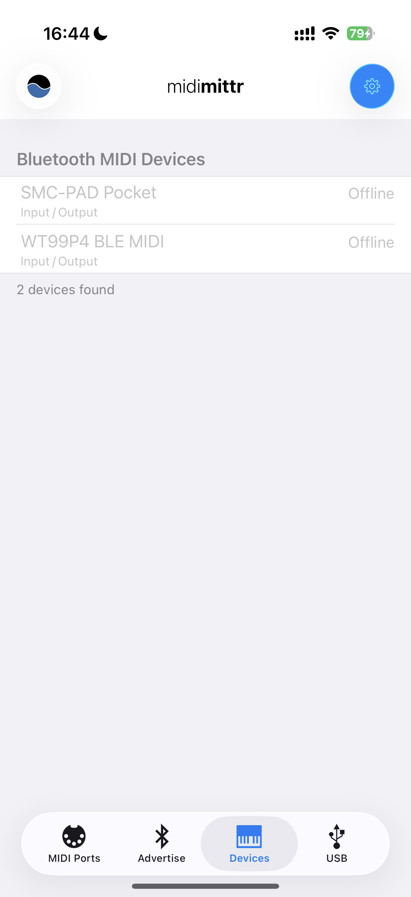
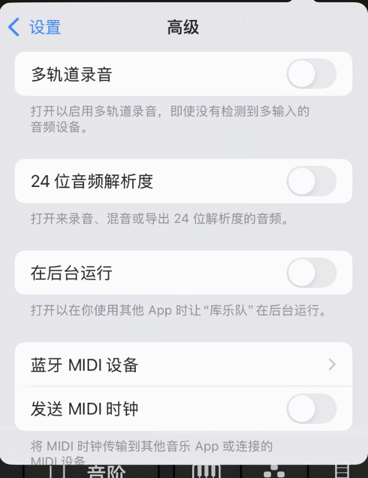

# 使用说明

这一页用于整理 WT99P4C5-S1 MIDI Piano 的三种使用方式：WiFi MIDI、蓝牙 BLE MIDI，以及单独 MIDI 键盘 + 喇叭。本页先保留说明框架，后续可继续补充截图、设备名称、连接细节和注意事项。

## 使用前准备

- WT99P4C5-S1 开发板已烧录当前 MIDI Piano 固件。
- USB MIDI 键盘。
- 喇叭或功放输出设备。
- 手机或平板已安装库乐队 GarageBand。
- WiFi 模式需要 MIDI Network。
- 蓝牙模式需要 midimittr。

## 1. WiFi / AppleMIDI 连接

### 使用场景

通过 WiFi 将开发板作为 AppleMIDI / RTP-MIDI 设备连接到手机或平板，再进入库乐队演奏。

### 需要的软件

- MIDI Network
- 库乐队 GarageBand

### 连接流程

1. 开发板上电，确认 WiFi MIDI 功能已开启，并打开手机热点，保证最大兼容性开关打开。
2. 修改`piano_config.h`中`WIFI_SSID`以及`WIFI_PASSWORD`定义文件，设置为热点名称和密码，连接至手机热点。
3. 打开 MIDI Network，搜索并`Contact`开发板暴露出的 AppleMIDI / RTP-MIDI 设备,名称为`WT99P4 Piano`。

{ width="320" }

4. 打开库乐队，进入键盘或其他乐器音轨。
5. 弹奏 USB MIDI 键盘，确认库乐队能够收到 MIDI 输入并发声（可以摘除喇叭，保证听到的声音源自库乐队）。

### 结果确认

- MIDI Network 中能看到设备连接状态 ,监视窗口反回 `peer = 1`。
- 库乐队音轨能够响应 MIDI 输入。
- USB MIDI 键盘输入能够通过 WiFi 转发到库乐队。

## 2. 蓝牙 BLE MIDI 连接

### 使用场景

通过 BLE MIDI 将开发板连接到手机或平板，再进入库乐队演奏。

### 需要的软件

- midimittr
- 库乐队 GarageBand

### 连接流程

1. 开发板上电，确认 BLE MIDI 功能已开启。
2. 打开 midimittr，搜索 BLE MIDI 设备 `WT99P4 BLE MIDI`。
3. 连接开发板对应的 BLE MIDI peripheral。

{ width="320" }

4. 打开库乐队，进入键盘或其他乐器音轨。
5. 点击库乐队右上角设置，进入高级，选择`蓝牙MIDI设备`，并连接到设备。

{ width="320" }

6. 弹奏 USB MIDI 键盘，确认库乐队能够收到蓝牙 MIDI 输入并发声。

### 结果确认

- midimittr 中设备显示已连接。
- 库乐队音轨能够响应 MIDI 输入。
- USB MIDI 键盘输入能够通过 BLE MIDI 转发到库乐队。

## 3. 单独 MIDI 键盘 + 喇叭

### 使用场景

不依赖 WiFi 和蓝牙，直接使用 USB MIDI 键盘控制开发板本地合成器，并通过喇叭发声。

### 需要的软件和硬件

- USB MIDI 键盘
- 喇叭或功放

### 连接流程

1. 将 USB MIDI 键盘接入开发板 USB Host 接口。
2. 将喇叭连接到开发板音频输出，打开MIDI键盘开关。
3. 开发板上电，等待 USB MIDI Host 初始化完成。
4. 弹奏 USB MIDI 键盘，确认开发板本地喇叭发声。

### 结果确认

- 开发板屏幕能够显示按下的琴键。
- 喇叭能够播放本地合成音。

