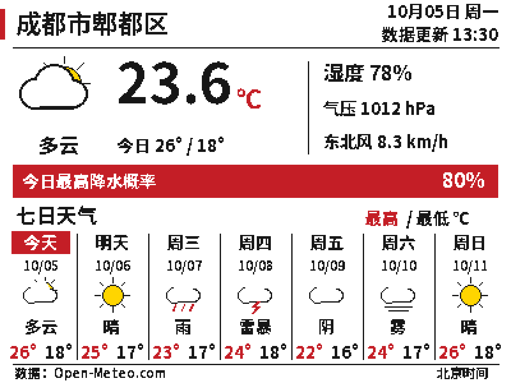

# WT32-ETH01 天气屏复刻日志

原项目是 ESP32 墨水屏天气显示器。这次改用 WT32-ETH01，在现有 VS Code 的 ESP-IDF 环境中编译，天气接口改成 Open-Meteo，最后把显示层换成适合 G 型四色屏的中文界面。

## 1. 下载原工程与调整引脚

先把 [原工程](https://github.com/henri98/esp32-e-paper-weatherdisplay) 下载到 `D:\ESP_PROJECT\esp32-e-paper-weatherdisplay`。联网方式继续使用 Wi-Fi，没有启用 WT32-ETH01 的 RJ45。

原引脚不能直接照搬到这块板上，屏幕改接 MOSI=14、CLK=17、CS=4、DC=33、RST=32、BUSY=35。这里最容易认错的是 GPIO17：板上扩展接口也写 TXD，但它是 TX2，不是烧录 UART0。

原工程的 OTA 按键也占 GPIO4，与新的屏幕 CS 冲突。按键改到只作输入的 GPIO39，外接 10kΩ 上拉，默认不启用。

## 2. 接入当前 ESP-IDF 环境

本机已有 VS Code IDF 环境，实际源码版本为 `v5.5.4-299-ge46782886f`，目标设为 `esp32`。工程没有换成 Arduino，而是更新原来的 IDF 组件依赖和接口。

Wi-Fi 事件改用 `esp_event`，网络接口使用 `esp_netif`，时间同步使用新版 SNTP，SPI 改为 SPI2。组件的 CMake 依赖也一并整理。

编译时还处理了重复全局变量定义、绘图尺寸参数遮蔽全局变量的问题。后面保留七列预报，修正了原来的跨午夜休眠秒数计算。

## 3. 换用 Open-Meteo

原工程使用 Dark Sky。这次换成 [Open-Meteo](https://open-meteo.com/en/docs)，个人非商业用途不用注册账号，也不需要 API Key。

地点先设成成都市郫都区郫筒一带，坐标为 30.80993、103.88253，接口时区用 `Asia/Shanghai`，本地显示时区用 `CST-8`。

请求一次获取当前温度、湿度、海平面气压、风速、风向、天气代码和昼夜状态，以及七天最高温、最低温和天气代码。降水提示取当天最大小时降水概率，不把它当成当前降水概率。

网络顺序改为先 NTP 校时，再发 HTTPS 请求。数据收齐、解析完成后停止 Wi-Fi，随后刷新墨水屏。接口失败就留住旧画面。

## 4. 编译成功，VS Code 仍有头文件红线

VS Code 显示 `build successful`，但 `esp_wifi.h`、`driver/gpio.h`、`math.h`、`stdint.h` 等头文件仍带红线，问题列表中是 `C/C++(1696)`。

问题来自 IntelliSense 没有使用当前 ESP32 编译器和编译数据库。编辑器配置改为引用 `build/compile_commands.json`，并补上工具链路径与生成配置头文件路径，重新加载窗口后再检查。

构建产物暂时保留，因为编译数据库和 `sdkconfig.h` 都在 `build` 中。源码编译通过与编辑器索引正常是两件事。

## 5. Wi-Fi 与天气请求跑通

Wi-Fi 名称和密码从自己已有的 `ws2812-8x8-wifi-matrix` 工程中取用，放在本地忽略文件里，没有写进公开源码。

烧录后，串口能看到获得 IP、NTP 校时、证书校验通过和天气返回。这一阶段网络已经工作，但屏幕仍然空白。

```text
esp-x509-crt-bundle: Certificate validated
open_meteo: Received current weather and seven-day forecast for Pidu, Chengdu
```

当时屏幕初始化日志里还有一条红色的 `EPDIF: All OK`。文字虽然写着 All OK，但代码用了错误级别打印，后来改成了正常的信息级别。它只说明 SPI 初始化走到这一处，不能证明屏幕收到了正确指令。

## 6. 最初按黑白 V2 驱动排查

一开始只知道屏幕是 4.2 英寸、板上写着 2.2，随后又按 V2 判断，先尝试了普通黑白 V2 的驱动。

这时的日志能打印初始化入口，但 BUSY 一直按高电平忙来等待，45 秒后超时：

```text
epd4in2_v2: hardware reset: BUSY GPIO35 remained HIGH for 45s; check panel, power and wiring
weather_to_display_task: e-Paper V2 init failed: ESP_ERR_TIMEOUT
```

期间有一次复位阶段能等到 idle，但初始化阶段仍超时。屏幕没有任何图像变化，天气程序随后进入休眠。

## 7. 单屏诊断与电压测量

为了把问题范围缩小，程序增加单屏诊断：关闭 Wi-Fi 和天气请求，SPI 降到 100kHz，不让 ESP32 进入深度睡眠，只测试屏幕。

测试失败后保留 60 秒窗口，RST 持续输出高电平，可以在这个阶段测 VCC、RST 和 BUSY。之前在休眠后测到 BUSY 变成 0V、RST 约 0.6V；这个读数受休眠后的引脚状态影响，不能直接用来判断刷新阶段。

调试供电用 DAPLink，5V 转 3.3V，屏幕也接 3.3V。曾怀疑供电，但静态读数全是 3.3V，并没有直接指出问题所在。后面继续对照示例和完整屏幕型号。

## 8. 确认屏幕是带 G 的型号

最后确认完整名称为 **4.2inch e-Paper Module (G)**。它不是普通黑白 V2，而是黑、白、黄、红四色屏。

重新对照 [Waveshare 官方 G 型 ESP32 示例](https://github.com/waveshareteam/e-Paper/blob/master/E-paper_Separate_Program/4in2_e-Paper_G/ESP32/EPD_4in2g.cpp)，初始化命令、复位时序、BUSY 极性和像素格式都要跟着换。

G 型实际调用的 BUSY 等待函数是低电平忙、高电平就绪；普通黑白 V2 驱动当时按相反极性等待。图像也从 1 位黑白变成 2 位四色，四个像素占一个字节，整帧 30000 字节。

G 型诊断图显示后，屏幕内容正常，看到黑、白、黄、红色带。此时保留已成功显示的 100kHz SPI，再切回天气程序。

## 9. 观察刷新耗时

屏幕显示正常后，肉眼观察刷新大约要几秒。为了分清是发送数据慢还是屏幕本身刷新慢，日志分成两个阶段：`Image transfer` 记录 30000 字节 SPI 发送耗时，`full refresh` 记录 BUSY 等待时间。

没有仅凭刷新速度继续改时序，先保持诊断时的 G 型初始化和全刷新流程。墨水屏没有背光，正常刷新也会出现画面转换。

## 10. 改成中文四色天气界面

G 型四色已经能显示，继续沿用黑白界面比较浪费。天气绘图改为直接生成四色缓冲区，不再先画黑白再转换。

地点改成“成都市郫都区”，天气、星期、风向和标签改成中文。太阳、月亮用黄色，预报最高温用红色，最低温与正文用黑色。今日最高降水概率达到 50% 时用红色提示栏，其余使用黄色。

中文字体从 Noto Sans SC 生成字符子集，只收录界面、天气翻译和地点用到的字符。普通正文与日期使用小字号，当前温度单独保留大号数字。

{ width="600" }

这张图是相同绘图代码生成的示例预览。主机端还检查了夜间、降水概率缺失、长地点名和极端负温的排版，以及天气代码的中文映射。

## 11. 本阶段结果

截至 2026-10-05，G 型四色诊断图已实机显示，Wi-Fi、校时和天气请求已有串口记录。中文四色天气版本完成编译，固件大小 `0x106280` 字节，1.5MiB 应用分区还剩 32%。

中文天气界面的实机效果待烧录确认；RJ45 没有接入程序，OTA 尚未实机验证。
